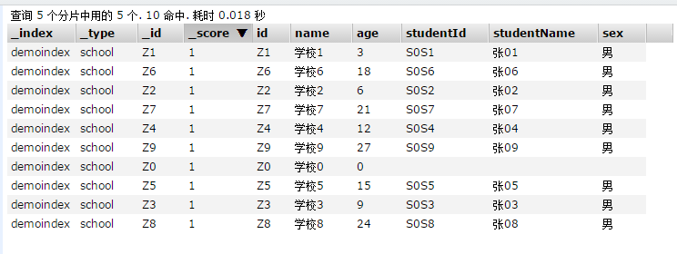
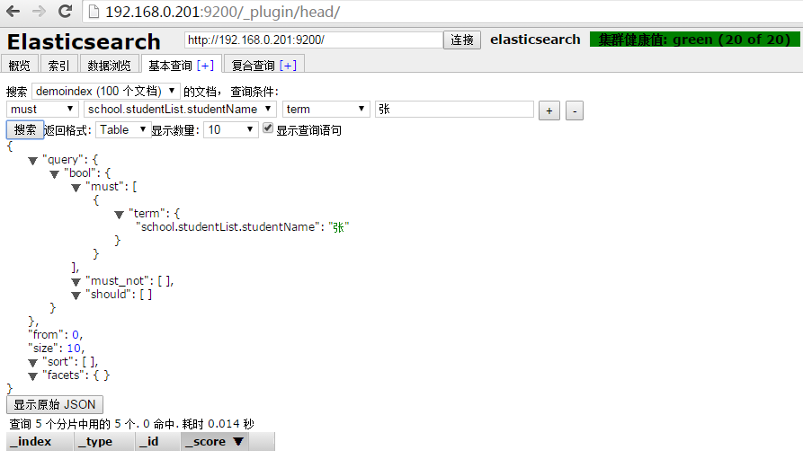
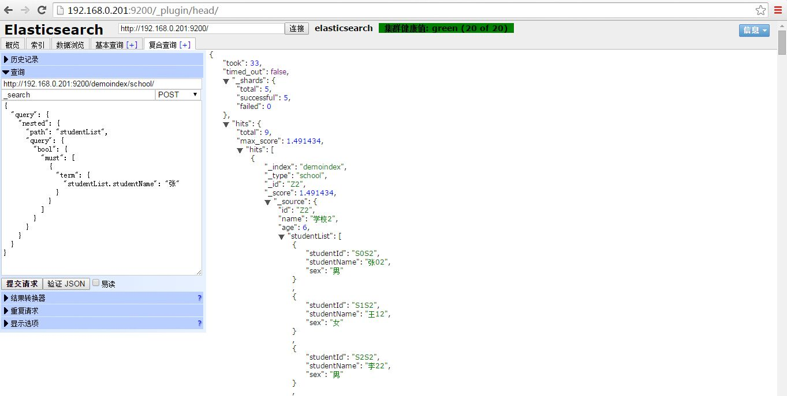

  通过代码创建了索引名称为demoindex，索引类型为school，以下是索引类型的数据映射结构：
   
{
    "state": "open",
    "settings": {
        "index.number_of_replicas": "1",
        "index.number_of_shards": "5",
        "index.version.created": "901399",
        "index.uuid": "-Z5eg5nnSp-VsNfUZAMN-A"
    },
    "mappings": {
        "school": {
            "properties": {
                "id": {
                    "store": true,
                    "analyzer": "ik",
                    "type": "string"
                },
                "name": {
                    "store": true,
                    "analyzer": "ik",
                    "type": "string"
                },
                "age": {
                    "store": true,
                    "type": "integer"
                },
                "studentList": {
                    "properties": {
                        "sex": {
                            "store": true,
                            "analyzer": "ik",
                            "type": "string"
                        },
                        "studentId": {
                            "store": true,
                            "analyzer": "ik",
                            "type": "string"
                        },
                        "studentName": {
                            "store": true,
                            "analyzer": "ik",
                            "type": "string"
                        }
                    },
                    "type": "nested"
                }
            }
        }
    },
    "aliases": []
} 
 
数据结构存在嵌套关系，学校属性中包含嵌套属性studentList，存放学校的学生。下面是demoindex中的所有数据：  

使用head进行如下查询，结果发现结果查不出来。这里我勾选了【显示查询语句】。

找不到答案只好求助于《Elasticsearch服务器开发》。经过查阅得知nested类型的嵌套查询需要使用专用搜索格式。先贴出原书描述：
  
{
"cloth" : {
"properties" : {
"name" : {"type" : "string", "index" : "analyzed"},
"variation" : {
"type" : "nested",
"properties" : {
"size" : {"type" : "string", "index" : "not_analyzed"},
"color" : {"type" : "string", "index" : "not_analyzed"}
}
}
}
}
}
 
可以看到，我们在 cloth类型中引入了新对象 variation，它是嵌套的（ type属性设置为
nested），表示想为嵌套文档建立索引。现在修改文档，添加 variation对象，其中有两个属性：
size和 color。示例产品将如下所示：

{
"name" : "Test shirt",
"variation" : [
{ "size" : "XXL", "color" : "red" },
{ "size" : "XL", "color" : "black" }
]
}
 
组织文档结构，以便每个尺寸及其匹配颜色成为一个独立文档。然而，如果执行之前的查询，
将无任何文档返回。这是因为，对于嵌套文件，需要使用专门的查询。因此，查询如下（当然，
我们已经再次创建了索引和类型）：   

curl -XGET 'localhost:9200/shop/cloth/_search?pretty=true' -d '{
"query" : {
"nested" : {
"path" : "variation",
"query" : {
"bool" : {
"must" : [
{ "term" : { "variation.size" : "XXL" } },
{ "term" : { "variation.color" : "black" } }
]
}
}
}
}
}'
 
现在，上述查询将无法返回索引中的文档，因为无法找到尺寸 XXL且颜色为黑色的嵌套文档。
这里简单讨论一下我们的查询，可以看到，我们使用 nested查询来查询嵌套文档。 path属性指
定了嵌套对象的名称（可以使用多个名称）。 nested类型包括了一个标准查询部分。应注意的是，
在嵌套对象中为字段名称指定完整的路径，在多级嵌套中很方便操作（这也是可能的）。

  
根据书中介绍将使用head的复合查询方式进行如下查询。成功，数据出现了！

