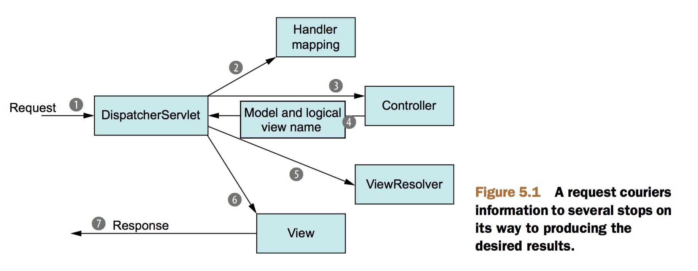
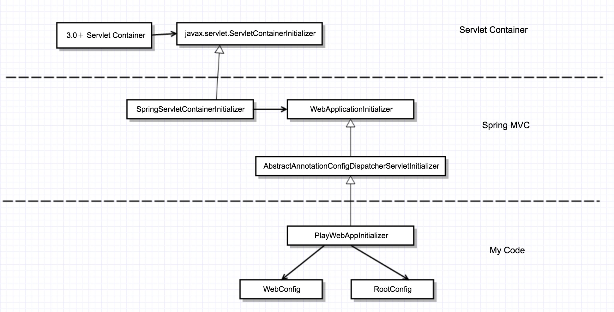

 
本篇记录使用纯java代码搭建SpringMVC工程的实践，只是一个demo。再开始之前先热身下，给出SpringMVC调用流程图，讲解的是一个http request请求到达SpringMVC框架后的过程，如下：
<figure>

</figure>
从servlet 3.0开始，实现javax.servlet.ServletContainerInitializer接口的类将在容器启动的时候执行onStartup方法。SpringMVC的”零配置”就是基于这个特性。所以对于servlet 3.0 以下的容器还是老老实实在web.xml中进行配置。
下面让我们一步步搭建SpringMVC，先上图：
<figure>

</figure>
上图中展示了启动关键类的初始化过程，首先容器启动，初始化并执行实现ServletContainerInitalzer接口的Spring类，该类初始化实现WebApplicationInitializer接口的PlayWebAppInitializer类（由于这里继承了AbstractAnnotationConfigDispatcherServletInitializer抽象类）。

在讲解PlayWebAppInitializer初始化了两个bean容器，一种是与DispatcherServlet相关联的MVC框架直接关系的bean,如：Controller，Service，Repository等等。再说另外一种bean容器前先回忆下，还记得ContextLoaderListener吧，做SSH框架整合时在web.xml中要配置这个类，所以说这个容器是配置更通用一些的bean。
那么问题来了：为什么要有两个共存呢？－－－－答：我猜想是方便分离，如果不想使用SpringMVC而实用其他MVC框架的可以把DispatcherServlet相关的那个bean容器拿掉。（纯属意淫，欢迎拍砖）。

这里WebConfig用来负责DispacherServlet相关bean的配置，RootConfig用来负责ContextLoaderListener相关bean的配置。
****************
下面截取一段《Spring in Action 4th》中关于两个ApplicationContext的原话，在135页：
## A TALE OF TWO APPLICATION CONTEXTS
When DispatcherServlet starts up, it creates a Spring application context and starts loading it with beans declared in the configuration files or classes that it’s given. With the getServletConfigClasses() method in listing 5.1, you’ve asked that Dispatcher- Servlet load its application context with beans defined in the WebConfig configura- tion class (using Java configuration).
But in Spring web applications, there’s often another application context. This other application context is created by ContextLoaderListener.
Whereas DispatcherServlet is expected to load beans containing web components such as controllers, view resolvers, and handler mappings, ContextLoaderListener is expected to load the other beans in your application. These beans are typically the middle-tier and data-tier components that drive the back end of the application.
136
CHAPTER 5 Building Spring web applications
Under the covers, AbstractAnnotationConfigDispatcherServletInitializer cre- ates both a DispatcherServlet and a ContextLoaderListener. The @Configuration classes returned from getServletConfigClasses() will define beans for Dispatcher- Servlet’s application context. Meanwhile, the @Configuration class’s returned get- RootConfigClasses() will be used to configure the application context created by ContextLoaderListener.
In this case, your root configuration is defined in RootConfig, whereas Dispatcher- Servlet’s configuration is declared in WebConfig. You’ll see what those two configura- tion classes look like in a moment.
**************

上实践的代码：
com.bob.playspring.PlayWebAppInitializer

package com.bob.playspring;

import org.springframework.web.servlet.support.AbstractAnnotationConfigDispatcherServletInitializer;

/**
 * 初始化DispatherServlet，代替在web.xml中到DispatherServlet配置,
 * @author bob
 *
 */
public class PlayWebAppInitializer extends AbstractAnnotationConfigDispatcherServletInitializer {

	@Override
	protected Class<?>[] getRootConfigClasses() {
		return new Class[] { RootConfig.class };
	}

	@Override
	protected Class<?>[] getServletConfigClasses() {
		return new Class[] { WebConfig.class };
	}

	/**
	 * identifies one or more paths that DispatcherServlet will be mapped to. 
	 *  In this case, it’s mapped to /, indicating that it will be the application’s default servlet. 
	 *   It will handle all requests coming into the application.
	 */
	@Override
	protected String[] getServletMappings() {
		return new String[] { "/" };
	}

}


com.bob.playspring.WebConfig

package com.bob.playspring;

import org.springframework.context.annotation.Bean;
import org.springframework.context.annotation.ComponentScan;
import org.springframework.context.annotation.Configuration;
import org.springframework.web.servlet.ViewResolver;
import org.springframework.web.servlet.config.annotation.DefaultServletHandlerConfigurer;
import org.springframework.web.servlet.config.annotation.EnableWebMvc;
import org.springframework.web.servlet.config.annotation.WebMvcConfigurerAdapter;
import org.springframework.web.servlet.view.InternalResourceViewResolver;

/**
 * 系统配置
 * @author bob
 *
 */
@EnableWebMvc
@Configuration
@ComponentScan("com.bob")
public class WebConfig extends WebMvcConfigurerAdapter {

	@Bean
	public ViewResolver viewResolver() {
		InternalResourceViewResolver resolver = new InternalResourceViewResolver();
		resolver.setPrefix("/WEB-INF/views/");
		resolver.setSuffix(".jsp");
		resolver.setExposeContextBeansAsAttributes(true);
		return resolver;
	}

	@Override
	public void configureDefaultServletHandling(DefaultServletHandlerConfigurer configurer) {
		configurer.enable();
	}

}



com.bob.playspring.RootConfig

package com.bob.playspring;

import org.springframework.context.annotation.ComponentScan;
import org.springframework.context.annotation.ComponentScan.Filter;
import org.springframework.context.annotation.Configuration;
import org.springframework.context.annotation.FilterType;
import org.springframework.web.servlet.config.annotation.EnableWebMvc;

@Configuration
@ComponentScan(basePackages = { "com.bob" }, excludeFilters = {
		@Filter(type = FilterType.ANNOTATION, value = EnableWebMvc.class) })
public class RootConfig {

}


关于Controller，Service，Repository的代码我就不贴了。
