
# 红黑树 

#### 1.红黑树的定义 
红黑树是平衡二叉查找树（Balance Search Tree）的一种，它拥有良好的最坏运行时间，可以保证查找、删除、添加节点操作在O(log n)时间内，其中n表示节点数。

>红黑树每个节点都带有颜色属性，红色或者黑色，除了BST的性质以外，还有以下性质：  
1. 节点是红色或黑色。   
2. 根是黑色。   
3. 所有叶子都是黑色（叶子是NIL节点）。   
4. 每个红色节点必须有两个黑色的子节点。（从每个叶子到根的所有路径上不能有两个连续的红色节点。）    
5. 从任一节点到其每个叶子的所有简单路径都包含相同数目的黑色节点。     

下面是一棵红黑树的例子，例子中为中序遍历降序排列，后面的操作中也按照这个顺序。  
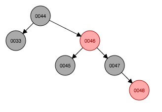   
例子中以节点48作为参考节点，类比人类社会，将47节点叫做它的父节点，46叫做它的祖父节点，45叫做它的叔父节点。

#### 2.红黑树操作简单例子

###### step 1 插入节点（44）
因为第一个节点是根节点，根据性质2，节点为黑色。  
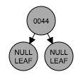

###### step 2 插入节点（45）
由于45大于44，所以作为节点44的右边孩子接入并设置为红色。可以看到性质5得到了保持。      
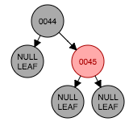

###### step 3 插入节点（46） 
46大于节点45应该作为右孩子接入设置为红色。显然违反了性质4  
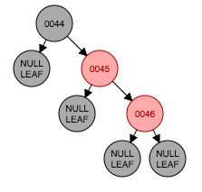   
以节点45为轴做左旋转,违反了性质2、4、5。    
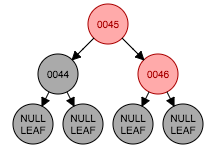  
 将45改为黑色（符合了性质2、4），将节点44改为红色（符合性质5）？？事实上我也可以将46节点涂成黑色？？得到全黑色节点   
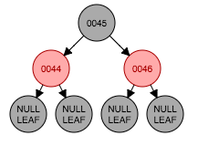

###### step 4 插入节点（47）
47大于节点46作为右孩子接入设置为红色。违反了性质4。  
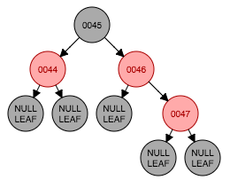   
这个时候47的父节点46与叔父节点都是红色 ，则祖父节点45颜色下降。但仍然违反性质2，因为47的祖父节点45是根节点。    
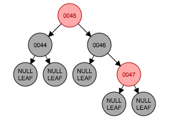    
将45颜色变为黑色。   
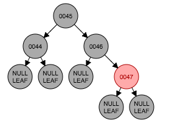 

###### step5 删除节点（45）
要删除节点45，首先将其左子树中最大节点44。   
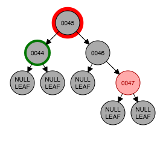   
将44节点的值拷贝到45节点处，移除老的44节点。此时违反了性质5。   
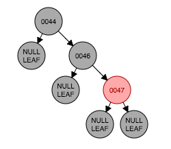    
以46节点为轴进行坐旋转。但仍然违反性质5。   
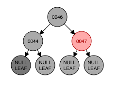   
将47节点设置为黑色。   
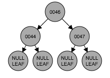 

#### 3.红黑树代码实现    
上面简单例子中插入以及删除节点操作并没有完全涵盖所有的情况。下面来看一看红黑树java代码实现。根据具体每一类情况，形成与之对应的代码操作。红黑树插入节点都按照红色插入。（维基百科解释：如果设为黑色，就会导致根到叶子的路径上有一条路上，多一个额外的黑节点，这个是很难调整的。但是设为红色节点后，可能会导致出现两个连续红色节点的冲突，那么可以通过颜色调换和树旋转来调整。）

##### 3.1 红黑树插入操作   
##### 
情形1:之前是棵空树，新插入的节点是树根。根据性质2，根节点必须是黑色。
   
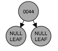  
    
public class abc{
   
}
   

#### 4.红黑树具体应用 

#### 5.希望解决的问题
1.红黑树叶子结点为什么是nil的，有什么用处，在应用中有什么意义？   
2.删除操作中一再强调的叶子结点是nil结点，非nil的叶子结点？

#### 6.参考
https://www.cs.usfca.edu/~galles/visualization/RedBlack.html   
https://github.com/julycoding/The-Art-Of-Programming-By-July/blob/master/ebook/zh/03.01.md
https://zh.wikipedia.org/wiki/%E7%BA%A2%E9%BB%91%E6%A0%91