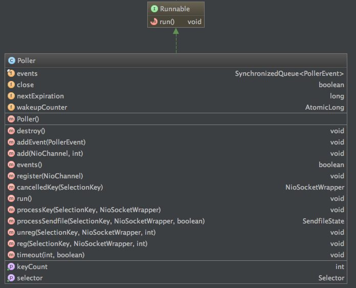

---
layout: post
title: "Tomcat8.5源码学习（一）NioEndPoint解析 "
date: 2017-08-13
excerpt: "tomcat"
tags: [tomcat]
--- 

   

### 一、NioEndPoint简介 

NioEndPoint是一款NIO定制的线程池，提供以下服务：   
* Socket acceptor 线程  
* Socket poller 线程    
* Worker 线程池   

启动Tomcat后，NioEndPoint负责创建处理TCP请求的socket

对比NioEndPoint和Nio2EndPoint两个类，但从存在的内部类来说，前者多了Poller和PollerEvent。
先来看看它们的作用是什么。  
    
Poller和PollerEvent     

---------------------------- 
下面说的socket都是SocketWrapper   

------------------------   

##### Poller是用来做什么的呢？   
内部维护了一个PollerEvent的同步循环队列，nextExpiration是下一次到期时间？

摸索中的定义：Pollor最核心作用是驱动selector执行选择操作，哪个socket好了，可以处理了就进行process。

------------------------
##### PollerEvent是用来做什么的呢？   
摸索中的定义：   
如果事件是注册(OP_REGISTER),那么将一个selector和一个socket绑定到一起。如果是其他操作，会将selector和socket的interestOps的值都设置成ops。

------------------------   
##### Acceptor作用是啥呢？  
摸索中的定义：   
The background thread that listens for incoming TCP/IP connections and
hands them off to an appropriate processor.    

------------------------    
##### SocketProcessor  
摸索中的定义： 

  
--PS:NioEndPoint类在Tomcat中的功能   
   socket可以接收UDP和TCP都可以接收吗？

### 二、NioEndPoint继承关系 