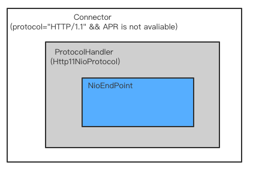
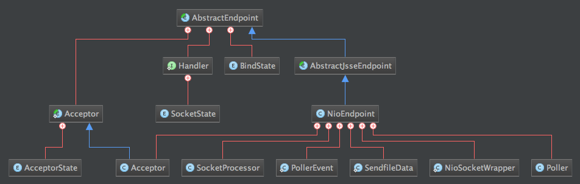
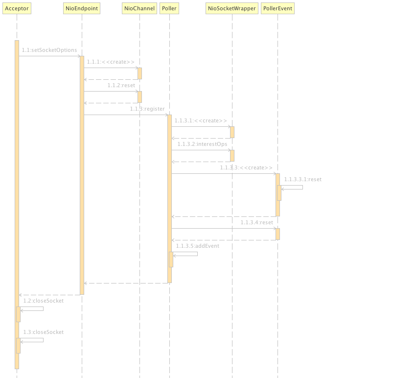
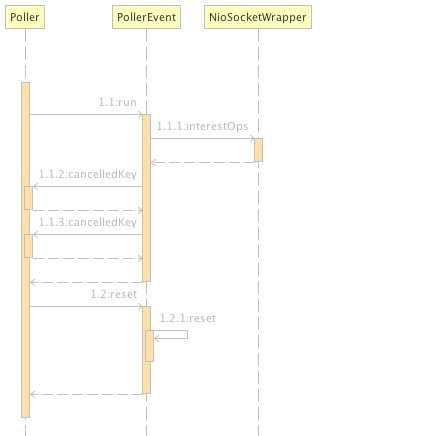

---
layout: post
title: "Tomcat8.5源码学习（一）NioEndPoint解析 "
date: 2017-08-13
excerpt: "tomcat"
tags: [tomcat]
--- 

   

## 1.NioEndPoint简介 

TCP/IP请求到达后，EndPoint负责处理TCP/IP请求，并且交给对应的处理器处理，本篇中讨论将范围限制在Http11NioProtocal中，所以处理的就是http请求。 根据命名可以知道它采用了非阻塞I/O的模式。值得一提，tomcat从8.5开始Connector取消了BIO模式的支持。
--PS:这个地方似乎有待确认。

NioEndPoint在Tomcat的Connector中所处的位置：   
   

NioEndPoint是一款NIO定制的线程池，提供以下服务：   
* Socket acceptor 线程  
* Socket poller 线程    
* Worker 线程池   
       

## 2.NioEndPoint内部组成   
NioEndPoint的继承关系如下图所示：   
    

### 2.1 Acceptor   
运行于后台的一个线程，监听到来的TCP/IP连接，并且将它们交给合适的处理者。  

### 2.2 Poller
内部维护了一个PollerEvent的同步循环队列，nextExpiration是下一次到期时间？

摸索中的定义：Pollor最核心作用是驱动selector执行选择操作，哪个socket好了，可以处理了就进行process。

### 2.3 PollerEvent   
PollerEvent, cacheable object for poller events to avoid GC
如果事件是注册(OP_REGISTER),那么将一个selector和一个socket绑定到一起。如果是其他操作，会将selector和socket的interestOps的值都设置成ops。

### 2.4 NioSocketWrapper

### 2.5 SocketProcessor
 --PS:NioEndPoint类在Tomcat中的功能   
   socket可以接收UDP和TCP都可以接收吗？
   
### 2.6 SendfileData

## 3.NioEndPoint内部处理    
1.接受请求：    
  

     Acceptor负责接收TCP/IP请求，对于新的连接则执行serverSocket.accept()。
     Poller轮询调用selector.select()得到“准备好的连接”，实际上这里类似
     while(true)的方式来调用selector.select()
     ### select()可以确保如果连接没有准备好接收数据，就绝对不会在这些连接上浪费时间 ###。
     PollerEvent事实上就是对SelectionKey中event的一次封装。
     SocketProcessor是将制定Socket交给具体handler处理的一次抽象与封装。

2.处理Poller事件   
 

## 4.参考    
http://tomcat.apache.org/tomcat-8.5-doc/index.html