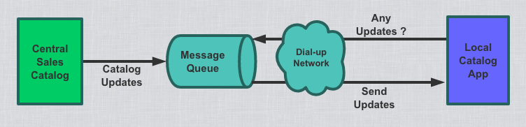

---
layout: post
title: "消息队列随笔"
date: 2017-08-13
excerpt: "消息队列随笔"
tags: [MQ]
--- 

#### 1.概述
消息队列是分布式组件的一种，用于进程间通信或者统一进程中不同线程间的通信。Group communication systems provide similar kinds of functionality.(这种在下面做比较)

消息组件一般支持2种模式：  
* 发送／接收  
* 发布／订阅
#### 2.消息队列能带来什么

https://www.iron.io/top-10-uses-for-message-queue/
##### 2.1 好处
###### 最大的好处，可靠性
https://stackoverflow.com/questions/12805377/what-is-activemq-used-for?noredirect=1&lq=1
参考的是以上：
使得两个分布式部署的进程之间进行可靠通信
  
######  松耦合
在项目一开始很难预测未来会有哪些需求。通过在多个进程之间引入一个基于数据的接口层，使得单独的进程可以独立变化而不影响其它进程（只要坚持满足相同的接口需求）  
--PS:Java中也可以使用interface来定义接口，和这个的不同是什么？

######  冗余   
处理数据的过程有时候会失败。除非这些数据是持久化的，否则将会永久丢失。为了缓解这种状况，队列持久化这些数据，直到完全处理完毕才移除它们。"发送消息->获取消息->删除消息"这个范例被很多消息队列使用。范例中“删除消息”步骤执行前需要一个进程明白得指出他已经处理完这个消息。这么做确保了你的数据可以被安全保存直到被处理完毕。
  
######  可扩展性    
因为消息队列使你的处理之间松耦合，所以仅仅通过增加更多的进程就可以提高消息队列中消息的增加与处理速率，不需要改变代码，不需要调整配置。     
--PS:Process也许可以翻译成其它的，不仅仅是 “处理”。显然这里的处理应该是可以独立运行的存在！！
应该翻译成进程！   

######  弹性 & Spikiability (Spiky Load)   
--PS:这个感觉不太好翻译Spiky Load,我感觉就是流量峰值的意思，Spiky是钉子。参考下这个：https://www.iron.io/spikability-applications-ability-to/

###### 可恢复性    
当整个架构中部分失败的时候，不需要整个系统因为这个问题而重启。消息队列使进程之间解耦，所以如果一个处理消息的进程失败并不影响向消息队列中增加消息的进程。当这个问题进程恢复后可以继续处理消息队列中的消息。 This ability to accept requests that will be retried or processed at a later date is often the difference between an inconvenienced customer and a frustrated customer.
  
###### 异步通信   
大部门情况下，你不想或者不需要马上处理一个消息。消息队列可以实现异步处理，允许将消息放入队列中而不立刻处理它。等到空闲的时候再来处理。比如日志信息等。
--PS：这里的异步通信可以使用Async类似做法代替吗？
 

###### 跨系统（Http也是跨系统的>_<，有没有，么有吧，比如ActiveMQ跨系统吗）

##### 2.2 坏处
###### 运维工作量增加   
使用消息队列引入更多的中间件，整个系统更容易出现故障需要排除。同时要保障消息队列的高可用。

#### 2.什么情况下我们需要引入消息队列   
消息队列的典型使用场景是什么？

###### 场景一   
关键词：接收和处理处理速度不对等、高可用
想象下你有一个服务，每秒钟要接收大量的请求，每个请求处理时间都比较长。要保证这些请求不能丢失，最终可以被处理掉。   
你的服务要实现高可用，并时刻做好接收新请求的准备，不能因为前面请求在处理中而被阻塞。   
 
在这个场景中，最好的办法就是在接受请求与处理请求之间放一个队列。这两个处理之间需要解耦，两方的任何一方不需要等待另一方。这样的话，即使段短时间内有大量的请求到来，最终负责处理请求的系统最终也能将他们处理掉。这个队列要能够在请求数过多的情况下可以持久化它们。     

你可以想象你们的业务以及工作量在不断增加，你需要扩展你的系统。现在只需要增加更多的worker进程来处理完所有的请求就行。   

除了在web服务和其它处理服务之间增加一个缓冲区以外，消息队列可以被用于更多的高级方案中。

--PS:上面说的可能要分成多个场景，得先看看其它的场景

###### 场景二   
想象下你有一个组织依赖于一组手机销售人员。这些销售人员将产品展示给目标顾客。在这个业务场景中，让销售人员能看到最新的可以售卖的产品信息非常重要。。到目前为止，我们应该能看到涉及到消息队列的至少有两个应用。（如下图）   
   
对于第一个应用，总部可以对中心销售登记系统（Central Sales Catalog）做些更新。这些更新随后通过消息队列发送给个人销售人员。消息队列系统将一直保留这些消息，直到销售人员将电脑接入到网络。接入网络后个人销售员电脑上的本地登记应用（Local Catalog App）将接收来自消息队列中的消息，这些消息中包含了更新本地登记的内容。  
这个例子比较老，是通过拨号这种

###### 场景三

### ForRerference
https://stackoverflow.com/questions/1035949/real-world-use-of-jms-message-queues

#### 3.与消息组件相似技术的比较
##### 3.1 Group communication system

##### 3.2 异步调用，如Spring @Async注解

##### 3.3 进程内queue

##### 3.4 Kafka Compare with traditional Message Entrs  System   
http://kafka.apache.org/documentation.html#kafka_mq   
The advantage of Kafka's model is that every topic has both these properties—it can scale processing and is also multi-subscriber—there is no need to choose one or the other.

#### 4.如何确定是不是真的需要消息队列
##### 4.1 需求是什么？
##### 4.2 根据需求都有哪些可以选择的方案？
##### 4.3 满足需求的最简单方案是什么？

#### 5.建议
##### 5.1 不要为了引入技术而引入

#### 6.参考
https://www.iron.io/top-10-uses-for-message-queue/
https://en.wikipedia.org/wiki/Message_queue
https://en.wikipedia.org/wiki/Group_communication_system
https://en.wikipedia.org/wiki/JGroups
https://en.wikipedia.org/wiki/Java_Message_Service
https://techblog.bozho.net/you-probably-dont-need-a-message-queue/
https://www.slideshare.net/Bozho/overview-of-message-queues
https://www.rabbitmq.com/tutorials/tutorial-three-spring-amqp.html
https://www.cloudamqp.com/docs/usecases.html
https://msdn.microsoft.com/en-us/library/aa480412.aspx
